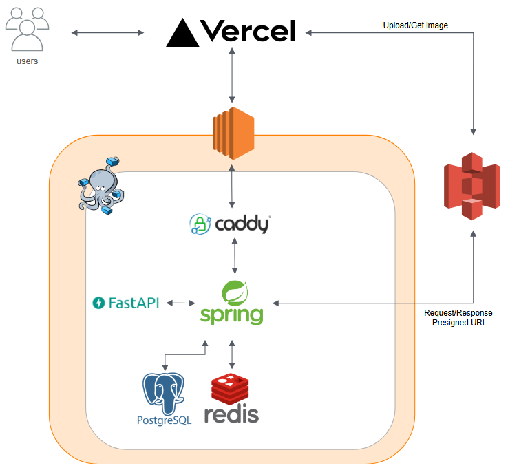

# 📓 Emotion Diary (감정 일기장)
사이트 주소
https://diary-web-qyme.vercel.app

Emotion Diary는 사용자가 일기를 작성하면 텍스트 기반 감정 분석을 수행하고,  
결과를 저장·조회할 수 있는 **웹 기반 감정 기록 서비스**입니다.

본 프로젝트는 모노레포(monorepo) 형태로 구성되어 있으며,  
API 서버, AI 분석 서버, 프론트엔드, 리버스 프록시를 하나의 저장소에서 관리합니다.

---

## ✨ Features

- Kakao, Google 소셜 로그인
- 일기 CRUD
- 감정 분석 요청 및 결과 저장
- JWT 기반 사용자 인증
- API 서버 ↔ AI 서버 분리 구조
- Docker Compose 기반 로컬 / 배포 환경 통합

---

## 🧱 Architecture

### Components

- **web/** : Frontend
- **api/** : Spring Boot API Server
- **ai-server/** : FastAPI Emotion Analysis Server
- **reverse-proxy/** : Caddy Reverse Proxy
- **docker-compose.yml** : Service orchestration

---

## 🛠 Tech Stack

### Backend
- Java 17
- Spring Boot
- Spring Security + JWT
- Spring Data JPA
- PostgreSQL
- Redis
- S3

### AI Server
- Python
- FastAPI

### Infra
- Frontend: Vercel
- Backend: AWS EC2 + Docker Compose
- GitHub Container Registry (GHCR)

---

## 📌 Deployment

- Frontend는 Vercel에서 배포
- Backend services (API / AI / DB / Redis / Proxy)는 AWS EC2 에서 Docker Compose를 사용해 실행
- Docker 이미지는 빌드된 후 GitHub Container Registry (GHCR)로 push

---

## 🚧 Future Improvements
- Emotion analysis 처리를 비동기화하기 위해 이벤트 기반 아키텍처 도입
- AI 서버를 별도의 EC2 인스턴스로 분리해 독립적인 확장 구조 구성
- CI/CD 도입
